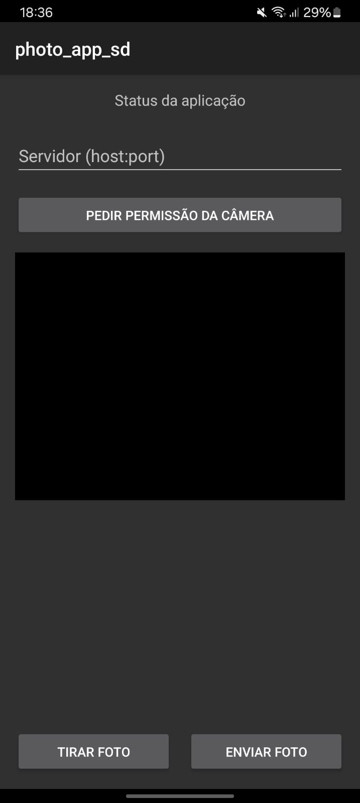
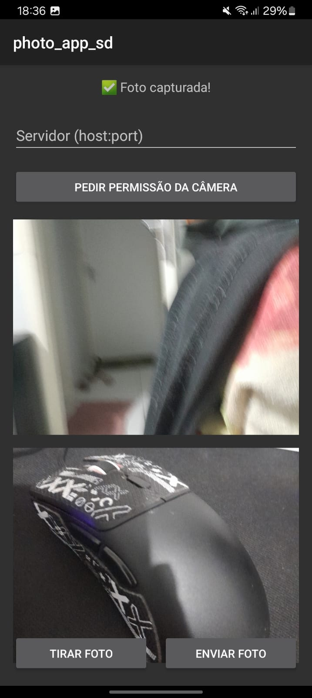
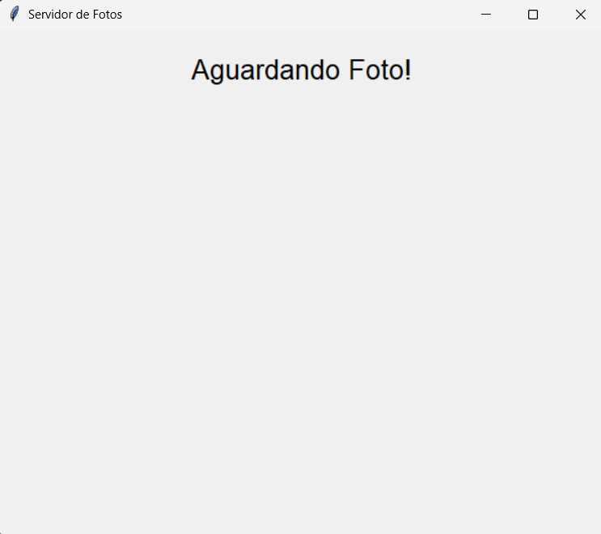

# Aplicativo de Fotos - Sistemas Distribuídos

Este projeto consiste em uma aplicação distribuída para captura e envio de fotos entre um aplicativo Android (cliente) e um servidor Python. O aplicativo permite ao usuário tirar fotos com a câmera do dispositivo e enviá-las para um servidor que as exibe em tempo real.

## Estrutura do Projeto

- `/photo_app`: Aplicativo Android em Kotlin
- `/server`: Servidor Python para receber as fotos

## Requisitos

### Servidor (Python)
- Python 3.7 ou superior
- Bibliotecas: `Pillow`, `tkinter` (normalmente já vem com Python)

### Cliente (Android)
- Android Studio Hedgehog (2023.1.1) ou superior
- JDK 11 ou superior
- Dispositivo Android com API 24 (Android 7.0) ou superior, ou emulador configurado

## Executando o Servidor

1. Navegue até o diretório do servidor:
   ```
   cd "/home/francinaldo/Área de trabalho/UFPI/2025.2/Sistemas Distribuidos Code/photo_APP-SD/server"
   ```

2. Instale as dependências necessárias:
   ```
   pip install Pillow
   ```

3. Execute o servidor:
   ```
   python app.py
   ```

4. Uma janela será exibida com a interface do servidor e o endereço IP para conexão será mostrado no console.
   Anote este endereço IP para usar no aplicativo Android.

## Executando o Aplicativo Android

### Método 1: Usando o Android Studio

1. Abra o Android Studio.

2. Selecione "Abrir um projeto existente" e navegue até o diretório `photo_app`.

3. Aguarde a sincronização do Gradle e a configuração do projeto.

4. Conecte um dispositivo Android via USB ou inicie um emulador.

5. Clique no botão "Run" (▶️) na barra de ferramentas ou pressione Shift+F10.

6. Selecione o dispositivo/emulador e clique em OK para instalar e iniciar o aplicativo.

### Método 2: Usando Linha de Comando

1. Navegue até o diretório do aplicativo:
   ```
   cd "/home/francinaldo/Área de trabalho/UFPI/2025.2/Sistemas Distribuidos Code/photo_APP-SD/photo_app"
   ```

2. Execute o build:
   ```
   ./gradlew assembleDebug
   ```

3. Instale o APK no dispositivo conectado:
   ```
   ./gradlew installDebug
   ```

## Imagens do Aplicativo e Servidor

### Tela do App
<div align="center">

  
  

</div>

### Tela do Servidor

